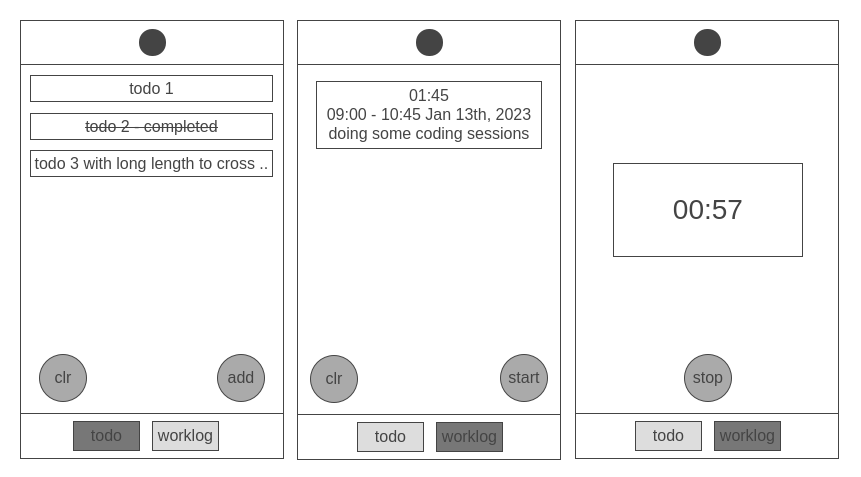

## Simple opinionated todo list mobile application
### Todo:
- [ ] worklog timer foreground service
- [ ] drag-n-drop reorder
- [ ] implement toast service
- [ ] fix swipe not being smooth and responsive
- [ ] change splash screen and app icon
- [x] ~~persistence~~
- [x] ~~swipe delete functionality~~
- [x] ~~add new functionality~~
- [x] ~~refactor persistence service~~
- [x] ~~clear all button~~
- [x] ~~random emoji~~ (removed)
- [x] ~~fix strike-through font rendering issue~~
- [x] ~~clean up template and css~~
- [x] ~~fix item order issue~~
- [x] ~~implement initial worklog functionality~~
- [x] ~~fix persian date angular pipe~~
- [x] ~~double tap to clear~~
- [x] ~~change persistence layer using couchdb plugin~~
- [x] ~~fix worklog timer (add plugins to keep screen on and set low brightness to save battery)~~

### Concept:
